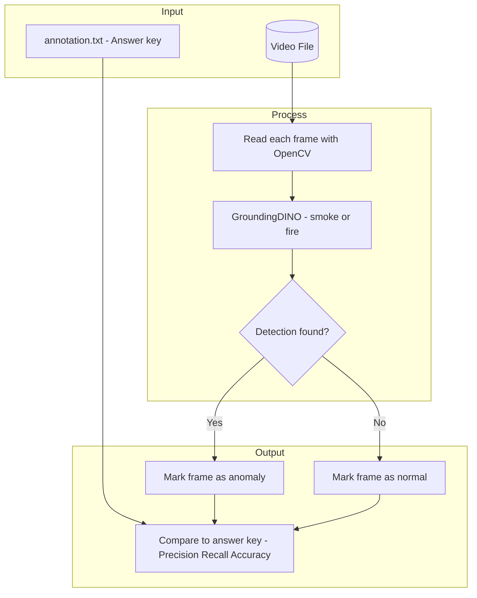

# Computer Vision Lab — Overview & How to Run

## What This Project Does

This project **finds explosions or fire in videos**. It:

1. Takes a video plus a list of which frames actually contain explosions (the "answer key")
2. Runs each frame through an AI that looks for smoke or fire
3. Compares the AI's guesses to the answer key and reports how well it did

---

## Simple Architecture



**Notebooks:**

- **`video_frame_extractor.ipynb`** — Loads video, parses the answer key, shows sample frames. No AI.
- **`GroundingDINO_Video_Frame_Analysis.ipynb`** — Full pipeline: AI detection + comparison to answer key.
- **`GroundingDINO.ipynb`** — Just the AI on single images (for testing), not for video.

---

## The Answer Key (`annotation.txt`)

One line per video:

```
Explosion033_x264.mp4  Explosion  970  1350  1550  3153
```

Meaning: video name, label, then pairs of frame numbers (start, end). Frames 970–1350 and 1550–3153 are "anomaly" (explosion); the rest are normal.

---

## How the AI Works (Plain English)

The project uses **GroundingDINO** — an AI trained to find things you describe in words. You give it a phrase like "smoke or fire" and it draws boxes around anything that matches. The model was trained on huge image datasets; **no extra training** is done here.

Each frame is treated like a photo. If the AI finds anything (above set cutoffs), that frame is marked as containing an explosion or fire.

**Metrics:**

- **Precision** — When it says "anomaly," how often is it right?
- **Recall** — Of all real anomalies, how many did it catch?
- **Accuracy** — Overall how many frames were correct?

---

## How to Run

**Recommended: Google Colab** (free GPU, no local setup)

### Step 1: Open Colab & Upload

1. Go to [colab.research.google.com](https://colab.research.google.com)
2. Upload `GroundingDINO_Video_Frame_Analysis.ipynb`, or clone this repo and open it from there.

### Step 2: Clone the Project

Run the first few cells. One of them clones this repo — you need that to get the video and `annotation.txt`.

### Step 3: Set Paths

In a cell near the top, make sure these match where your files end up:

- `explosionVideo` — Path to the video file (e.g. `.../videos/Explosion033_x264.mp4`)
- `annotation_file` — Path to `annotation.txt` (e.g. `.../annotation.txt`)

If you cloned the repo into `/content/`, typical paths might be:

- `explosionVideo = '/content/Computer-Vision-Lab/videos/Explosion033_x264.mp4'`
- `annotation_file = '/content/Computer-Vision-Lab/annotation.txt'`

### Step 4: Run All Cells

Use **Runtime → Run all** (or run cells top to bottom). The notebook will:

1. Clone GroundingDINO and install dependencies
2. Download the AI model weights (~50 MB)
3. Load the model and your video
4. Process every frame (can take a while for long videos)
5. Print precision, recall, and accuracy at the end

**Note:** Enable a GPU for faster runs: **Runtime → Change runtime type → Hardware accelerator: GPU**.

### Running Locally (Advanced)

You need:

- Python 3.8+
- GPU with CUDA (for reasonable speed)
- `pip install opencv-python torch supervision`

Then clone the [GroundingDINO repo](https://github.com/IDEA-Research/GroundingDINO), install it with `pip install -e .`, download the weights, and run the notebook cells in order — adjusting paths for your machine.
